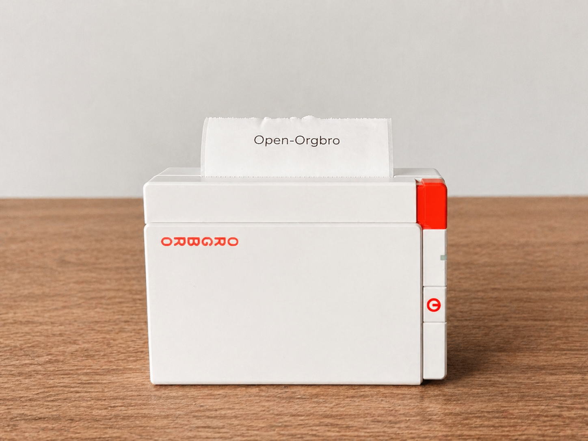

# ORGBRO X3 Lab
Reverse engineering and interoperability work for driving an ORGBRO X3 thermal printer without relying on the Snap & Tag app.



Detailed Italian notes remain available in [README-ita.md](README-ita.md).

## What this is
This repository documents how to talk to the ORGBRO X3 from local tools and simple Python scripts instead of depending on the vendor software. The practical goal is to make the printer usable in more open, repeatable, and automatable workflows: BLE probing, paper feed, replaying captured jobs, and generating and printing local raster text.

This is a reverse engineering lab more than a polished SDK. It contains experiments, captures, diagnostic scripts, and a first working path for printing text locally.

## In one sentence
If you want the short version: this repo can currently discover the printer, inspect its GATT profile, feed paper, and print locally generated raster text to the ORGBRO X3 from Python.

## Project status
- experimental and evolving;
- built pragmatically and iteratively from real device tests more than from a formal design upfront;
- the code and docs describe what has been verified so far, but they do not guarantee a complete explanation of every internal detail;
- best treated as a technical base and reverse engineering notebook, not as a supported end-user product.

In honest terms: it works, but it is also a vibe-coded research repo. Speed of exploration, real-world testing, and documenting results came before polish.

## What works today
- BLE scanning and discovering the X3;
- GATT inspection of the printer;
- confirmed paper feed command;
- replay of some captured jobs;
- local raster text generation and printing without Snap & Tag;
- local PNG preview without Bluetooth so layout can be checked before printing.

## Quick start
Prerequisites:
- Python 3.11+ recommended;
- macOS with Bluetooth available;
- ORGBRO X3 powered on;
- Snap & Tag closed while running BLE tests.

Setup:
```bash
python3 -m venv .venv
source .venv/bin/activate
pip install -r requirements.txt
```

Important on macOS:
- run BLE commands from `Terminal.app`;
- do not launch BLE printing from hosts that spawn Python without the right Bluetooth/TCC permissions;
- if `Snap & Tag` is open, close it before testing so it does not hold the connection.

Recommended order:
1. generate a local preview without Bluetooth;
2. try a paper feed;
3. print text from `Terminal.app`.

Local preview without Bluetooth:
```bash
python3 scripts/q2_print_text.py "Hello world" --height-rows 120 --font-size 64 --preview /tmp/x3-preview.png --preview-only
```

Paper feed sanity check:
```bash
python3 scripts/q2_feed.py --filter x3 --steps 24 --wait-after 2
```

Print text from `Terminal.app`:
```bash
python3 scripts/q2_print_text.py "Hello world" --height-rows 120 --font-size 64 --feed-steps 160
```

For a repo photo:
```bash
python3 scripts/q2_print_text.py "Open-Orgbro" --height-rows 140 --font-size 72 --feed-steps 180
```

## Support and expectations
This repository is published to share the work, not as a service with guaranteed support. We may not be able to explain every choice or every protocol byte immediately, especially in areas that came out of fast, iterative reverse engineering. If something is unclear, the best way to improve it is with an issue or PR that includes context, tests, or extra captures.

## Privacy and published files
Device-specific identifiers and some environment-specific details from local testing have been redacted in the files shared publicly. Public example captures live in `captures/public/`.

The local bundle `tools/X3Python.app` may still be useful on the development machine, but it is treated as a local artifact and is not meant to be versioned or published.

## Quick troubleshooting
- If Python crashes with a TCC error or mentions `NSBluetoothAlwaysUsageDescription`, that is not necessarily a repo bug: on macOS you need to run BLE scripts from `Terminal.app`.
- If the printer does not respond, make sure it is powered on and that `Snap & Tag` is closed.
- If you want to validate layout before using Bluetooth, use `--preview-only`.

## Goal
Build a local tool, initially a Python CLI, that can:
- discover the printer over Bluetooth Low Energy;
- identify GATT services and characteristics;
- test candidate protocols in a controlled way;
- print black-and-white text and raster images.

## Verified data from our unit
- visible BLE name: `X3`;
- observed macOS BLE address: `REDACTED-BLE-ADDRESS`;
- manufacturer-data / app MAC: `REDACTED-MANUFACTURER-MAC`;
- custom service `0000ff00-0000-1000-8000-00805f9b34fb`;
- notify characteristic `0000ff01-0000-1000-8000-00805f9b34fb`;
- write characteristic `0000ff02-0000-1000-8000-00805f9b34fb`;
- additional notify characteristic `0000ff03-0000-1000-8000-00805f9b34fb`.

## Snap & Tag app
- bundle: `/Applications/Snap & Tag.app/Wrapper/SnapTag.app`;
- executable: `/Applications/Snap & Tag.app/Wrapper/SnapTag.app/SnapTag`;
- bundle id: `com.snap-Tag.www`;
- observed version/build: `2.3.2` / `0417100302`;
- relevant frameworks and symbols: `YKPrinterKit`, `YZWManager`, `YKInstructTool`.

## Confirmed protocol
The X3 does not use plain ESC/POS for the useful commands here, and PrintMaster-style `51 78 ... ff` attempts did not move paper. The app uses YK/YZW/Q2 frames on `ff02`:

`64 <cmd> <seq> <len_lo> <len_hi> <payload...> 00 00 00 00 9b`

Total length is `10 + payload_len`. `seq` is masked to 6 bits.

Confirmed commands:
- `0x80` payload `01`: token/init;
- `0x10` empty payload: status;
- `0x11` empty payload: firmware;
- `0x09` 1-byte payload: density;
- `0x0a` 1-byte payload: speed;
- `0x02` 2-byte little-endian payload: paper feed.

Firmware probe:
- write `6411030000000000009b`;
- response `64f1330200222dec5834129b`;
- payload `22 2d`, displayed by the app as firmware `45.34`.

## Confirmed paper feed
The first local physical movement was obtained with BLE command `0x02` and payload `18 00` (24 steps), preceded by the token:

`python3 scripts/q2_frame_probe.py --filter x3 --sequence token,0x02:1800 --out captures/q2_frame_probe_token_feed02_24.json --wait-after 4`

Sent frames:
- token: `648001010001000000009b`;
- feed 24 steps: `64020202001800000000009b`.

Observed responses/status:
- `64ff21080076070a1009034643cb5934129b`;
- `64ff2408007207021009034643c25934129b`.

Reusable command:
`python3 scripts/q2_feed.py --filter x3 --steps 24 --out captures/q2_feed_24.json`

Equivalent generic probe:
`python3 scripts/q2_frame_probe.py --filter x3 --sequence token,feed:24 --out captures/q2_feed_24.json`

## Protocols ruled out for now
- ESC/POS `DLE EOT` and standard raster: accepted at GATT level but no useful behavior;
- PrintMaster `51 78 ... ff` feed/raster: no confirmed movement;
- candidate YK/Q2 `0x0c:00`, `0x50:a1`, `0x51`, `0x52:00`: no confirmed movement;
- `0x1f` PrintMaster-like zlib path: no useful print output.

## Image raster path
Static analysis suggests the image path goes through `0x101066be8`, which splits raster data into chunks and wraps them in YK/Q2 frames. The BLE command for those chunks is read from global `0x10198c350`.

Function `0x101068798` sets that global to:
- `0x05` when its argument is non-zero;
- `0x00` when its argument is zero.

So `0x05` is the main candidate for image raster chunks.

Builder `0x101066a70` converts the image into 1-bit MSB-first raster: set bit = black, row width `ceil(width_dots / 8)`. For X3 the app default is 384 dots, so 48 bytes per row.

Minimal candidate test:
`python3 scripts/q2_raster_test.py --filter x3 --pattern center --rows 8 --post-feed 24 --out captures/q2_raster_center_8.json`

If chunks are accepted but no black appears, also try the observed task-end from the generator:
`python3 scripts/q2_raster_test.py --filter x3 --pattern black --rows 16 --chunk-rows 4 --task-end 0x51 --post-feed 64 --out captures/q2_raster_black_16_end51.json`

Another test with observed start/setup:
`python3 scripts/q2_raster_test.py --filter x3 --pattern black --rows 16 --chunk-rows 4 --start 0x50:a1 --task-end 0x51 --end 0x52:00 --post-feed 64 --out captures/q2_raster_black_16_start50_end51_52.json`

Current result:
- `0x05` chunks are accepted by the printer;
- BLE ACKs arrive and the final feed moves paper;
- no visible black appears yet.

## New clues from the real Q2 path
Later binary analysis showed that the app high-level path is:
- `printPhotoProcQ2:` -> `-[YKPrintManager universalPrintImage:params:]`
- `-[YKPrintManager universalPrintImage:params:]` -> `-[YKPrintManager universalPrintDataForImage:params:]`
- `universalPrintDataForImage:params:` builds the job through `YKInstructTool`.

The Q2 path passes a `YKParamsConfig` object with at least these fields:
- `printerTypeName`
- `speed`
- `density`
- `isFirst`
- `isLast`
- `isCut`
- `rightMarign`

The binary also contains names for steps/commands that appear to belong to the image print preamble:
- `pointsPerMM`
- `dotsNum`
- `pkgLength`
- `setSpeed`
- `setDensity`
- `setDevicePaperType`
- `specFeedPaper`
- `feedToMid`
- `feedWithParams`
- `feed`
- `ImgA01`
- `taskEnd`

There are also sequencing strings that suggest a multi-step job model, not just raw raster chunks:
- `first&setSpeed`
- `first&setDensity`
- `first&setDevicePaperType`
- `first&specFeedPaper`
- `first&feedToMid`
- `nonFirst&feedWithParams`
- `nonFirst&feed`
- `nonFirst&feedToMid`
- `last&feedToMid`
- `last&taskEnd`

That explains why `0x05` alone is probably not enough: some job/page/head setup likely needs to happen before image chunks.

## PacketLogger capture: `Hello world`
We captured a real print from Snap & Tag with PacketLogger and analyzed the `.pklg` file.

Confirmed findings:
- the real text print does not use `0x05` in the observed job;
- after connection, MTU, and subscribe, the app sends a firmware probe `0x11`;
- the real job then starts with:
  - `0x0a` payload `78`
  - `0x09` payload `0c`
  - a series of `0x00` frames
  - final feed `0x02` payload `c8 00`
- the captured job contains:
  - `22` groups of raw BLE writes to `ff02`;
  - `65` raw chunks total;
  - `38` reconstructable full YK frames;
  - `35` print frames `0x00`, almost all with `432` bytes of payload, plus a final `324`.

Reconstructed frame distribution:
- `seq 15`: `0x0a:78`
- `seq 16`: `0x09:0c`
- `seq 17..51`: `0x00` with `432`-byte raster/chunk payload (`seq 51` uses `324`)
- `seq 52`: `0x02:c800`

Important observation:
- the `0x00` frames are not all solid black;
- non-empty rows are concentrated roughly from `seq 30` to `seq 41`, consistent with the `Hello world` text region in the layout.

Useful added script:
- extract / replay raw data from PacketLogger:
  `python3 scripts/q2_replay_pklg.py --summary-only /path/to/file.pklg`
- replay the captured job:
  `python3 scripts/q2_replay_pklg.py --replay /path/to/file.pklg`

This is the strongest point reached so far: there is now a path to reprint a real captured job from the app even before every protocol command is understood semantically.

## Working local text generator
We created `scripts/q2_print_text.py`, which generates 1-bit raster with Pillow and prints without Snap & Tag.

Confirmed findings from the first successful run:
- `0x00` is the correct raster command for the observed text/Q2 path;
- raster payload uses `432`-dot rows (`54` bytes) and logical chunks of `8` rows (`432` bytes);
- BLE writes must be split into raw chunks of about `240` bytes, like Snap & Tag did in the PacketLogger capture;
- launching from `Codex -> Python` crashes because of macOS TCC/Bluetooth behavior, while `Terminal.app -> Python` works and correctly shows/uses the Bluetooth permission.

Working command:
`python3 scripts/q2_print_text.py "Hello world" --width-dots 432 --height-rows 180 --x 48 --y 48 --font-size 48 --feed-steps 200 --raw-chunk-size 240`

First test note:
- the print came out correctly but was probably duplicated because a previous attempt was still queued/buffered, or because multiple Terminal tabs had nearby jobs;
- for clean tests, close older Terminal tabs and run only one job at a time.

## Final achieved state: centered `Hello world`
Confirmed success: the X3 prints locally generated Python text without Snap & Tag.

Key correction after the first tests:
- the correct logical raster width is not `432` dots;
- the printer interprets `0x00` frames as raster with width `864` dots;
- each raster frame still carries `432` bytes, so:
  - `864` dots = `108` bytes per row;
  - `432` bytes per frame = `4` rows per frame;
- using width `432` made two consecutive rows get interpreted as two half-rows side by side, producing two `Hello world` prints next to each other.

Parameters that now work in `scripts/q2_print_text.py`:
- `--width-dots 864` default;
- `--rows-per-chunk 4` default;
- `--raw-chunk-size 240` default;
- `--align center` default;
- `--valign middle` default;
- `--x` / `--y` are optional manual overrides;
- centering is computed by measuring the real text bounding box with Pillow.

Final good command, to be run from Terminal:
`python3 scripts/q2_print_text.py "Hello world" --height-rows 120 --font-size 64 --feed-steps 160 --raw-chunk-size 240`

To print other text:
`python3 scripts/q2_print_text.py "Your text here" --height-rows 120 --font-size 64 --feed-steps 160`

Important on macOS / TCC:
- run BLE scripts from `Terminal.app`, not from the Codex process;
- `Codex -> Python -> CoreBluetooth` may crash because of TCC and `NSBluetoothAlwaysUsageDescription`;
- `Terminal.app -> Python` works and already has the right path for Bluetooth permission prompts;
- if a Bluetooth permission popup appears, press `Allow`.

Practical sequence to restart in a new session:
1. power on the X3;
2. close Snap & Tag so it does not take the BLE connection;
3. open Terminal;
4. run:
   `python3 scripts/q2_print_text.py "Hello world" --height-rows 120 --font-size 64 --feed-steps 160`
5. if the text is too big or too small, change `--font-size`;
6. if you need more or less paper after printing, change `--feed-steps`.

Sanity check command, paper feed only:
`python3 scripts/q2_feed.py --filter x3 --steps 24 --wait-after 2`

Local preview command without Bluetooth:
`python3 scripts/q2_print_text.py "Hello world" --height-rows 120 --font-size 64 --preview /tmp/x3-preview.png --preview-only`

## Next steps
Sensible moves from here:
- stabilize `scripts/q2_print_text.py` as the main entry point;
- calibrate margins, font size, page height, and final feed;
- map the real setup command bytes (`setSpeed`, `setDensity`, `pointsPerMM`, `dotsNum`, `pkgLength`, `ImgA01`, `taskEnd`) semantically inside `YKInstructTool`;
- verify whether `0x00` and `0x05` are two different raster transport modes or whether `0x05` belongs to another firmware path.
